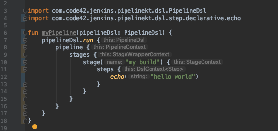
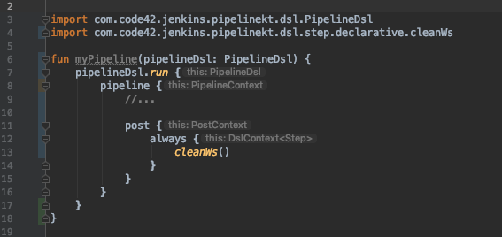

# Implementing the DSl

`DslContext<T>` is the core class of the dsl.  Its essentially a queue, and each dsl method will ad an item to the queue to
be processed in order.  Each code block has its own context.

The `DslContext<T>` is also a vehicle for injecting configuration and building shared functionality.

## Example with Steps

Lets say we have a block like:

```kotlin
pipeline {
    stages {
        stage("my build") {
            steps {
                echo("hello world")
            }
        }
    }
}
```

Our dsl will transform this to an object that looks like:

```kotlin
val pipeline = Pipeline(stages = listOf(Stage.Steps(name = "my build", steps = listOf(Echo("hello world")))))
```

These classes are not meant to be instantiated by end users, but they are the result of the dsl, and can be serialized into a jenkinsfile (or maybe one day interpretted directly)

How does it achieve this? Lets look at a couple of paired down implementations.

First, lets get a screenshot form the ide so we can see they types:



When `echo` runs, it adds a step to `this`, which is an instance of `DslContext<Step>`. This is propogated up through the dsl,
and `stages` produces a `Stage.Steps` instance, which contains the instance of `Echo`.  That stage in turn is added to
the resulting `Pipeline` object.

## Other Context classes

There are some specialized Context classes, such as `PostContext`.  `PostContext` implements the methods for always such
as `always` and `success`, which in turn take a step context, so inside of a pipeline block.



DSLContext<T> didn't fit in with this implementation.  DslContext has a single queue of Steps, but post has several 
inernal contexts from which steps can be called. Each of these has its own scope, thus a custom context implementation 
was warranted.

The Pipeline and StageContext classes take this even further by having child contexts of various types - for example the
`agent`, `options`, and `trigger` blocks. For now we will stick with Post as an example:

The [post context](https://github.com/code42/pipelinekt/blob/d732295afb0328b0675f98e2f2c81076ddba4614/dsl/src/main/kotlin/com/code42/jenkins/pipelinekt/dsl/post/PostContext.kt) simply tracks multiple instances of `DslContext<Step>` (one per block) and is able to produce a `Post` 
object which represents the post block:

```kotlin
class PostContext(val alwaysContext: DslContext<Step> = DslContext<Step>(),
                 val successContext: DslContext<Step> = DslContext<Step>(),
                 val cleanupContext: DslContext<Step> = DslContext<Step>()) {
   fun always(alwaysBlock: DslContext<Step>.() -> Unit) {
       alwaysContext.alwaysBlock()
   }

   fun success(alwaysBlock: DslContext<Step>.() -> Unit) {
       successContext.alwaysBlock()
   }

   fun cleanup(alwaysBlock: DslContext<Step>.() -> Unit) {
       cleanupContext.alwaysBlock()
   }

   fun toPost(): Post = Post(always = alwaysContext.drainAll().toStep(), success = successContext.drainAll().toStep(), cleanup = cleanupContext.drainAll().toStep())
}
```

# Creating the Pipeline

The dsl outputs a pipeline object, this pipeline object (and everything in it that is part of the Jenkinsfile) knows how to
serialize itself into a Jenkinsfile.

`Pipeline`, `Stage`, `Post`, `Step` and other members in the Pipeline object all extend `GroovyScript`.  This part of the 
api is not intended to be exposed to consumers of the library, and the majority of implementations are found in the
[`internal`](https://github.com/code42/pipelinekt/blob/d732295afb0328b0675f98e2f2c81076ddba4614/internal) project, which is not packaged as a compile time dependency of `dsl` and are not available in source
unless the internal project is added as a specific compile time dependency.

# Conclusion

We have gone over how the dsl is implemented and transformed into an object.  At this point, you should have a high level
understanding of how the dsl is architected and how it is transformed into an object that can be serialized into a Jenkinsfile.